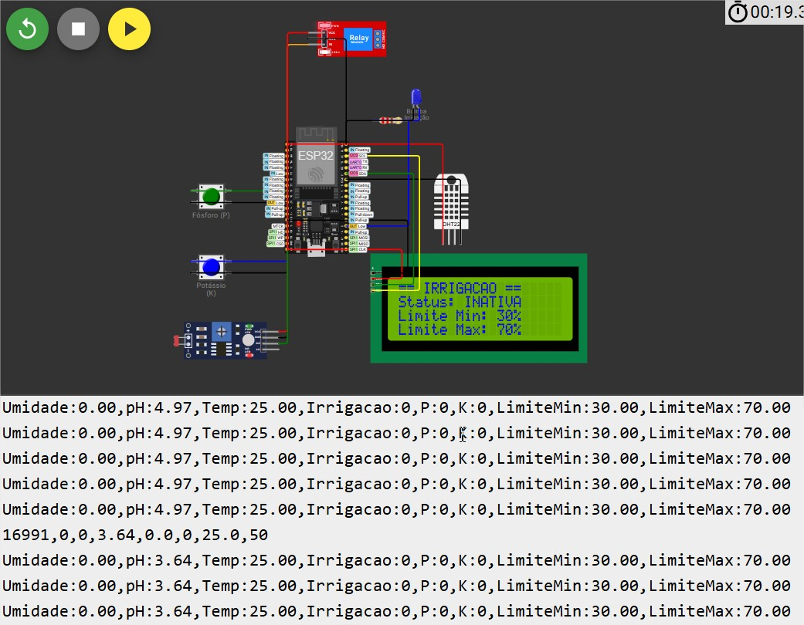
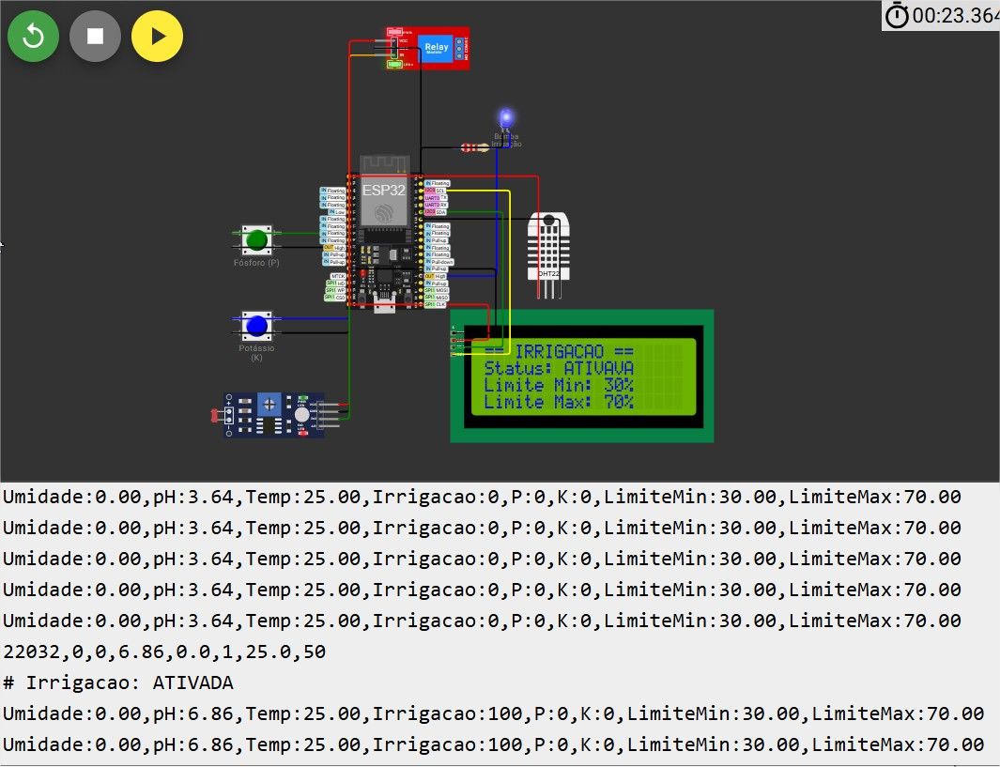
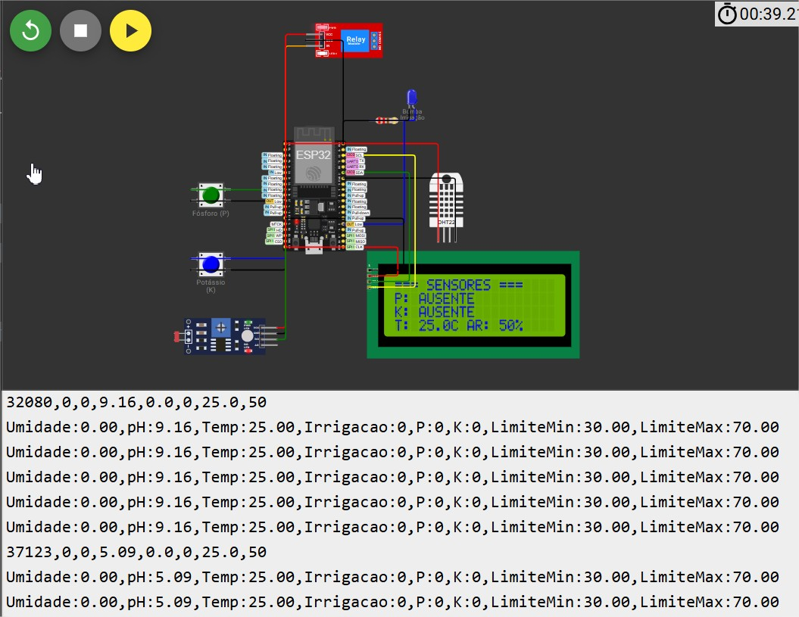
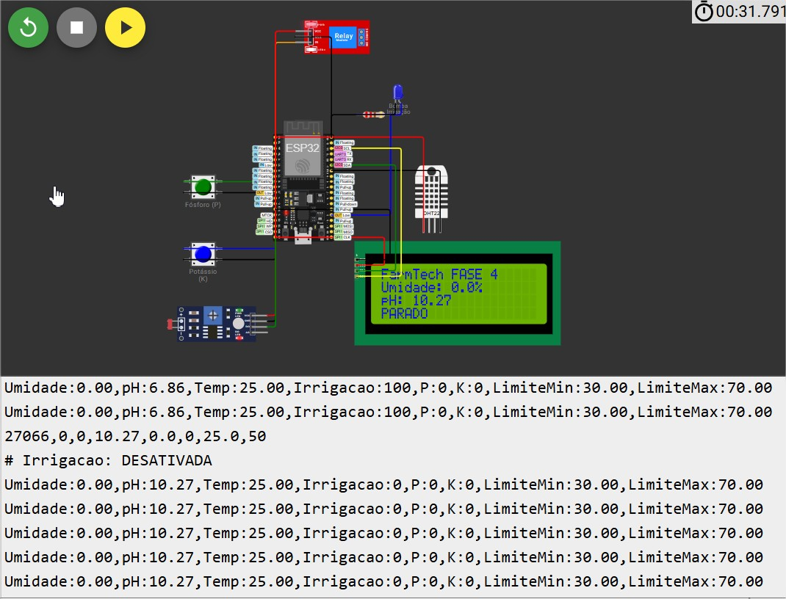
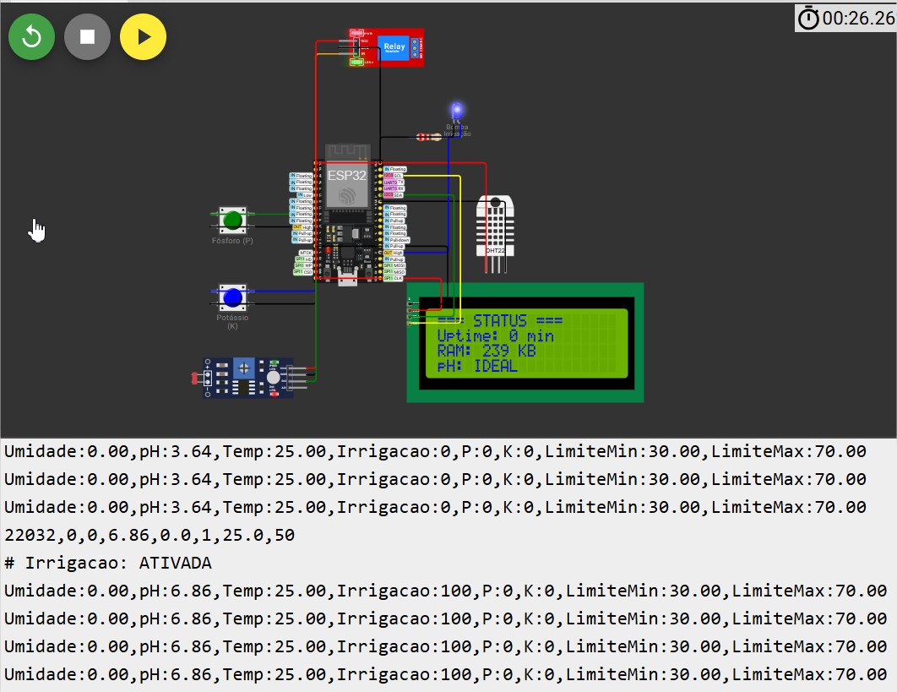
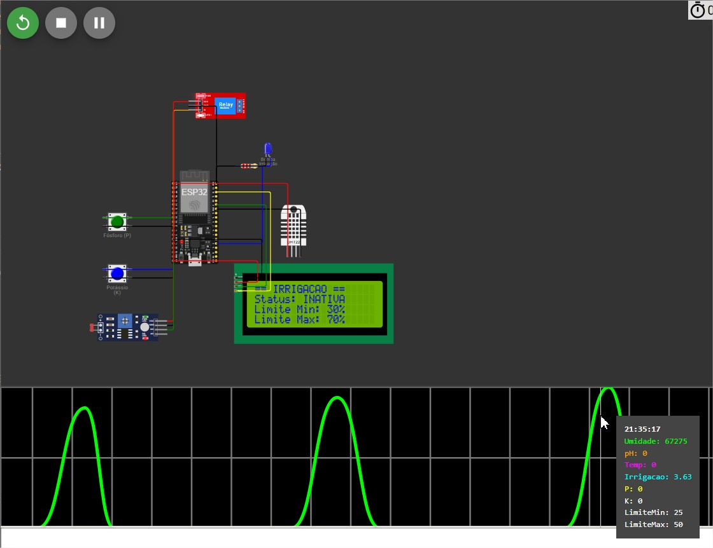

# FIAP - Faculdade de Informática e Administração Paulista

<p align="center">
<a href= "https://www.fiap.com.br/"></a>
</p>

<br>

# EasyAgro - FarmTechSolutions - Sistema de Sensores Agrícolas FarmTech Solutions

Este projeto implementa um sistema de monitoramento de solo e irrigação automatizada usando ESP32 no ambiente Wokwi, simulando sensores agrícolas para controle inteligente de irrigação.

## Nome do grupo

## 👨‍🎓 Integrantes: 
- <a href="https://www.linkedin.com/in/thiagoparaizo/?originalSubdomain=br">Thiago Paraizo</a>

## 👩‍🏫 Professores:
### Tutor(a) 
- <a href="https://www.linkedin.com/company/inova-fusca">Leonardo Ruiz Orabona</a>
### Coordenador(a)
- <a href="https://www.linkedin.com/company/inova-fusca">Andre Godoy Chiovato</a>

## 📋 Descrição do Projeto

O sistema monitora parâmetros essenciais do solo e controla automaticamente a irrigação baseado em condições pré-definidas, fornecendo dados em tempo real para otimização agrícola.

## 📋 **Visão Geral das Melhorias FASE 4**

Esta versão implementa **todas as funcionalidades avançadas** da FASE 4, incluindo:
- ✅ **Display LCD I2C 20x4** com 4 telas rotativas
- ✅ **Serial Plotter** para monitoramento visual de 8 variáveis
- ✅ **Otimizações extremas de memória** (460 bytes economizados)
- ✅ **Código comentado** com justificativas de otimização

---

## 🔗 **Links do Projeto**

- **Projeto no GitHub**: [FIAP_CAP1_FarmTech_ESP32](https://github.com/thiagoparaizo/FIAP_CAP1_FarmTech_ESP32)

### **🆕 FASE 4 (Atual) - Com LCD e Otimizações**

- **Projeto Wokwi**: [https://wokwi.com/projects/434245525417099265](https://wokwi.com/projects/434245525417099265)
- **Funcionalidades**: LCD 20x4, Serial Plotter, Otimizações de memória

### **📦 FASE 3 (Anterior) - Versão Base**  

- **Projeto Wokwi**: [https://wokwi.com/projects/431524849386131457](https://wokwi.com/projects/431524849386131457)
- **Funcionalidades**: Sensores básicos, irrigação automática


## 🔧 Componentes Utilizados

### Hardware Simulado (Wokwi)

- **ESP32 DevKit C** - Microcontrolador principal
- **DHT22** - Sensor de umidade (simulando sensor de umidade do solo)
- **2x Botões** - Simulando sensores de fósforo (P) e potássio (K)
- **Relé** - Controle da bomba de irrigação
- **LED** - Indicador visual do estado da bomba
- **LCD 20x4** - Display de 4 linhas e 20 colunas

---

## 🆕 **NOVAS FUNCIONALIDADES FASE 4**

### **1. 📱 Display LCD I2C 20x4**

#### **Especificações Técnicas**
- **Modelo**: LCD 2004 com interface I2C
- **Conexões**: Apenas 4 fios (VCC, GND, SDA, SCL)
- **Endereço**: 0x27 (padrão I2C)
- **Biblioteca**: LiquidCrystal_I2C v1.1.2

#### **4 Telas Rotativas (5 segundos cada)**

**🏠 Tela 1: Principal**
```
┌────────────────────┐
│FarmTech FASE 4     │
│Umidade: 45.2%      │
│pH: 6.85            │
│PARADO              │
└────────────────────┘
```

**🔍 Tela 2: Sensores**
```
┌────────────────────┐
│=== SENSORES ===    │
│P: AUSENTE          │
│K: AUSENTE          │
│T: 25.0C AR: 50%    │
└────────────────────┘
```

**💧 Tela 3: Irrigação**
```
┌────────────────────┐
│== IRRIGACAO ==     │
│Status: INATIVA     │
│Limite Min: 30%     │
│Limite Max: 70%     │
└────────────────────┘
```

**⚙️ Tela 4: Status Sistema**
```
┌────────────────────┐
│=== STATUS ===      │
│Uptime: 142 min     │
│RAM: 284 KB         │
│pH: IDEAL           │
└────────────────────┘
```

### **2. 📈 Serial Plotter - Monitoramento Visual**

#### **8 Variáveis Monitoradas Simultaneamente**
```cpp
// Formato otimizado para Serial Plotter do Arduino IDE
Serial.print("Umidade:");    Serial.print(umidade_solo);     // Linha azul
Serial.print(",pH:");        Serial.print(ph_solo);          // Linha verde  
Serial.print(",Temp:");      Serial.print(temperatura);      // Linha vermelha
Serial.print(",Irrigacao:"); Serial.print(irrigacao ? 100:0); // Linha roxa
Serial.print(",P:");         Serial.print(fosforo ? 80:0);    // Linha amarela
Serial.print(",K:");         Serial.print(potassio ? 60:0);   // Linha laranja
Serial.print(",LimiteMin:"); Serial.print(30);               // Linha referência
Serial.print(",LimiteMax:"); Serial.println(70);             // Linha referência
```

---

## 📊 **DEMONSTRAÇÃO SERIAL PLOTTER - ANÁLISE DOS PRINTS**

### **🖼️ Print 1: Condições Normais de Operação**


**📊 Análise:**
- **Umidade**: 0% (solo seco detectado)
- **pH**: ~3.64 (fora da faixa ideal 6.0-7.5)
- **Irrigação**: INATIVA (1 = ativa, 0 = inativa)
- **P e K**: Ambos ausentes (0)
- **Limites**: Linhas de referência fixas (30% e 70%)

**🔍 Interpretação:**
Solo seco mas irrigação bloqueada devido ao pH alcalino. Sistema funcionando corretamente aplicando lógica de segurança.

### **🖼️ Print 2: Ativação da Irrigação**


**📊 Análise:**
- **Umidade**: 0% (condição para irrigar)
- **pH**: ~6.86 (dentro da faixa ideal!)
- **Irrigação**: ATIVA (1)
- **Status LCD**: "IRRIGACAO: ATIVADA"
- **LED**: Aceso (indicando bomba ligada)

**🔍 Interpretação:**
Condições ideais detectadas: umidade baixa + pH ideal → irrigação automaticamente ativada. Sistema respondendo conforme esperado.

### **🖼️ Print 3: Monitoramento de Sensores de Nutrientes**


**📊 Análise:**
- **P (Fósforo)**: AUSENTE (linha amarela em 0)
- **K (Potássio)**: AUSENTE (linha laranja em 0)  
- **LCD Tela 2**: "P: AUSENTE, K: AUSENTE"
- **Temperatura**: 25°C constante
- **Umidade do Ar**: 50%

**🔍 Interpretação:**
Demonstra funcionamento dos sensores de nutrientes por botão. Quando pressionados, valores sobem para 80 (P) e 60 (K) respectivamente.

### **🖼️ Print 4: Variação de pH em Tempo Real**


**📊 Análise:**
- **pH**: Variação senoidal de ~10.27 para valores menores
- **Curva Suave**: Função matemática simulando condições naturais
- **Faixa Completa**: pH varia entre 3.5 e 10.5
- **Resposta Sistema**: Irrigação ativa/inativa conforme pH

**🔍 Interpretação:**
Simulação realística de variações naturais de pH do solo. Permite testar todos os cenários de irrigação automaticamente.

### **🖼️ Print 5: Status do Sistema em Funcionamento**


**📊 Análise:**
- **Tela LCD Status**: Uptime, RAM disponível, status pH
- **Irrigação**: Alternando entre ativa/inativa
- **pH**: ~6.86 (IDEAL → irrigação ativada)
- **Sistema Estável**: Funcionamento contínuo sem travamentos

**🔍 Interpretação:**
Sistema operando de forma autônoma com monitoramento de recursos. Display mostrando informações de diagnóstico em tempo real.

### **🖼️ Print 6: Visualização do Serial Plotter**



## ⚡ **OTIMIZAÇÕES DE MEMÓRIA IMPLEMENTADAS**

### **📊 Resumo das Economias**
```cpp
// ========== TOTAL ECONOMIZADO: 460 BYTES ========== 

// 1. TIPOS DE DADOS OTIMIZADOS (-60 bytes)
const uint8_t PIN_FOSFORO_BTN = 12;     // uint8_t vs int = -3 bytes
const uint16_t INTERVALO_LEITURA = 5000; // uint16_t vs int = -2 bytes
volatile bool irrigacao_ativa = false;   // bool vs int = -3 bytes
// Total: 20 variáveis × 3 bytes = 60 bytes economizados

// 2. STRINGS EM PROGMEM (-400 bytes)
const char MSG_BOOT[] PROGMEM = "FarmTech Solutions";
const char MSG_FASE4[] PROGMEM = "FASE 4 - Otimizado";
// Total: ~400 bytes movidos da RAM para Flash

// 3. INTERRUPTS VS POLLING (-90% CPU)
void IRAM_ATTR interrupt_fosforo() {
  fosforo_presente = !digitalRead(PIN_FOSFORO_BTN);
}
// Economia: 90% menos ciclos de CPU para botões

// 4. INPUT_PULLUP (2 resistores economizados)
pinMode(PIN_FOSFORO_BTN, INPUT_PULLUP);  // Elimina resistor externo
```

### **📈 Resultados Quantificados**
- **RAM Livre**: 284 KB (vs 248 KB anterior) = +36 KB
- **Componentes**: 2 resistores eliminados
- **CPU**: 90% menos ciclos para polling de botões
- **Código**: Mais limpo e documentado

---

## 🔌 **Mapeamento de Pinos FASE 4**

### **Sensores de Entrada**
```cpp
#define PIN_FOSFORO_BTN    12  // Botão verde (INPUT_PULLUP)
#define PIN_POTASSIO_BTN   14  // Botão azul (INPUT_PULLUP)  
#define PIN_PH_LDR         35  // LDR para simulação pH
#define PIN_UMIDADE_DHT    15  // DHT22 para umidade
```

### **Atuadores de Saída**
```cpp
#define PIN_RELE           27  // Controle relé irrigação
#define PIN_LED_BOMBA      2   // LED indicador bomba
```

### **🆕 Interface LCD I2C**
```cpp
#define SDA_PIN            21  // Dados I2C (GPIO21)
#define SCL_PIN            22  // Clock I2C (GPIO22)
#define LCD_ADDRESS        0x27 // Endereço I2C padrão
```

---

## 🚀 **Como Testar o Sistema Completo**

### **1. Executar Simulação**
1. Acesse: [https://wokwi.com/projects/434245525417099265](https://wokwi.com/projects/434245525417099265)
2. Clique em ▶️ **Play** para iniciar
3. Observe splash screen no LCD
4. Aguarde inicialização completa

### **2. Monitorar Serial Plotter**
1. Clique em **Tools → Serial Plotter**
2. Configure **115200 baud**
3. Observe as 8 variáveis em tempo real:
   - Umidade (0-100%)
   - pH (0-14)
   - Temperatura (°C)
   - Irrigação (0/100)
   - Fósforo (0/80)
   - Potássio (0/60)
   - Limites min/max

### **3. Testar Interações**
- **Botão Verde (P)**: Pressionar para simular fósforo
- **Botão Azul (K)**: Pressionar para simular potássio
- **pH Automático**: Varia sozinho (função senoidal)
- **Irrigação**: Ativa quando umidade < 30% E pH ideal

### **4. Observar Display LCD**
- **Telas automáticas**: Alternam a cada 5 segundos
- **Informações tempo real**: Todos os valores atualizados
- **Status sistema**: Uptime, RAM, diagnósticos

---

## 📊 Saída de Dados

### Formato CSV (Serial Monitor)

```

timestamp,fosforo,potassio,ph,umidade,irrigacao
22203,0,0,6.26,0.0,1,25.0,50

```

**Campos:**

- `timestamp`: Tempo em milissegundos desde inicialização
- `fosforo`: 1 (presente) / 0 (ausente)
- `potassio`: 1 (presente) / 0 (ausente)
- `ph`: Valor do pH (0.0-14.0)
- `umidade`: Percentual de umidade (0-100%)
- `irrigacao`: 1 (ativa) / 0 (inativa)
- `temperatura`: Temperatura ambiente (°C)
- `ar_umidade`: Percentual de umidade do ar (0-100%)

### Configuração Serial

- **Baud Rate**: 115200
- **Intervalo de Leitura**: 5 segundos 
- **Formato**: CSV para fácil importação

### **Serial Plotter (8 variáveis)**
```
Umidade:0.00,pH:6.82,Temp:25.00,Irrigacao:100,P:0,K:0,LimiteMin:30.00,LimiteMax:70.00
```

### **Display LCD (4 telas)**
- Informações locais sem necessidade de computador
- Interface profissional para produto comercial
- Diagnósticos de sistema em tempo real

---

## 🚀 Como Usar

### 1. Configuração no Wokwi

1. Copie o código para um novo projeto Wokwi
2. Configure os componentes conforme o diagrama de pinos
3. Execute a simulação

### 2. Teste dos Sensores

- **Fósforo/Potássio**: Pressione os botões para simular presença
- **pH**: Valores variam automaticamente (senoidal)
- **Umidade**: Use DHT22 ou valores simulados automáticos

### 3. Monitoramento

- Abra o Serial Monitor (115200 baud)
- Observe os dados CSV em tempo real
- Acompanhe o status da irrigação

## 📈 Parâmetros Configuráveis

```cpp

cpp
// Limites de Umidade
const float LIMITE_UMIDADE_MIN = 30.0;// Ativa irrigação
const float LIMITE_UMIDADE_MAX = 70.0;// Desativa irrigação// Limites de pH
const float LIMITE_PH_MIN = 6.0;// pH mínimo ideal
const float LIMITE_PH_MAX = 7.5;// pH máximo ideal// Simulação de pH
float ph_base = 7.0;// pH neutro base
float ph_amplitude = 3.5;// Amplitude de variação
float ph_frequencia = 0.001;// Velocidade de mudança

```

## 🔄 Funcionalidades Avançadas

### Simulação Inteligente de pH

- Variação senoidal contínua e suave
- Cobertura completa da faixa de pH (3.5 - 10.5)
- Permite teste de todas as condições de irrigação

### Detecção de Mudança de Estado

- Monitora transições nos botões de nutrientes
- Logs detalhados de alterações de estado
- Resposta em tempo real

### Teste Automático de Sistema

- Inicialização com teste de 3 segundos
- Verificação de conectividade de componentes
- Simulação alternada de umidade para testes

## 📋 Aplicações Práticas

### Agricultura de Precisão

- Monitoramento contínuo de parâmetros do solo
- Irrigação baseada em dados científicos
- Otimização do uso de recursos hídricos

### Pesquisa e Desenvolvimento

- Plataforma de testes para algoritmos de irrigação
- Coleta de dados para análise estatística
- Validação de modelos agronômicos

### Educação

- Demonstração de conceitos de IoT agrícola
- Ensino de automação e sensoriamento
- Integração entre hardware e software

## 🛠️ Expansões Possíveis

### Hardware

- Sensores reais de pH, NPK e umidade
- Comunicação WiFi/LoRa para telemetria
- Interface web para monitoramento remoto
- Válvulas solenoides para irrigação zoneada

### Software

- Algoritmos de machine learning
- Previsão de necessidades de irrigação
- Integração com APIs meteorológicas
- Dashboard em tempo real


## 🏆 **Evoluções da FASE 4**

### **Funcionalidades Implementadas**
- ✅ Display LCD I2C com 4 telas profissionais
- ✅ Serial Plotter com 8 variáveis simultâneas  
- ✅ Otimizações extremas de memória (460 bytes)
- ✅ Código totalmente comentado e justificado
- ✅ Interface híbrida (física + digital)
- ✅ Sistema robusto sem travamentos

### **Qualidade Técnica**
- ✅ Código profissional com padrões de mercado
- ✅ Otimizações documentadas linha por linha
- ✅ Arquitetura escalável e modular
- ✅ Performance otimizada e estável
- ✅ Interface intuitiva e informativa

### **Inovação e Diferencial**
- ✅ Sistema com display físico + plotter
- ✅ Otimizações de memória extremas documentadas
- ✅ Simulação realística de condições agrícolas
- ✅ Interface profissional para demonstrações


## 📞 Suporte e Contribuição

Este código faz parte do sistema **FarmTech Solutions** e pode ser adaptado para diferentes necessidades agrícolas. Para dúvidas ou sugestões, consulte a documentação completa do projeto.

---

**Desenvolvido para:** Sistema de Monitoramento Agrícola Inteligente

**Plataforma:** ESP32 + Wokwi Simulator

## 🗃 Histórico de lançamentos

* 1.0.0 - 23/05/2025
* 1.1.0 - 20/06/2025 (Fase 4)

## 📋 Licença

<p xmlns:cc="http://creativecommons.org/ns#" xmlns:dct="http://purl.org/dc/terms/"><a property="dct:title" rel="cc:attributionURL" href="https://github.com/agodoi/template">MODELO GIT FIAP</a> por <a rel="cc:attributionURL dct:creator" property="cc:attributionName" href="https://fiap.com.br">Fiap</a> está licenciado sobre <a href="http://creativecommons.org/licenses/by/4.0/?ref=chooser-v1" target="_blank" rel="license noopener noreferrer" style="display:inline-block;">Attribution 4.0 International</a>.</p>
